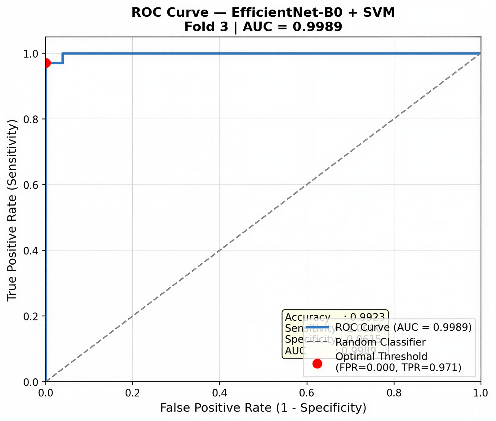
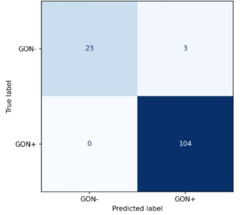
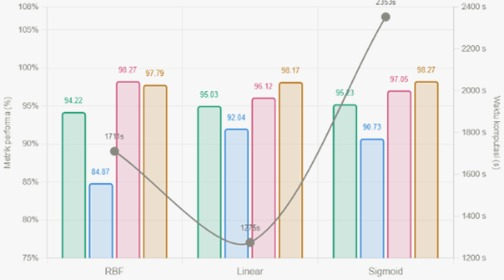
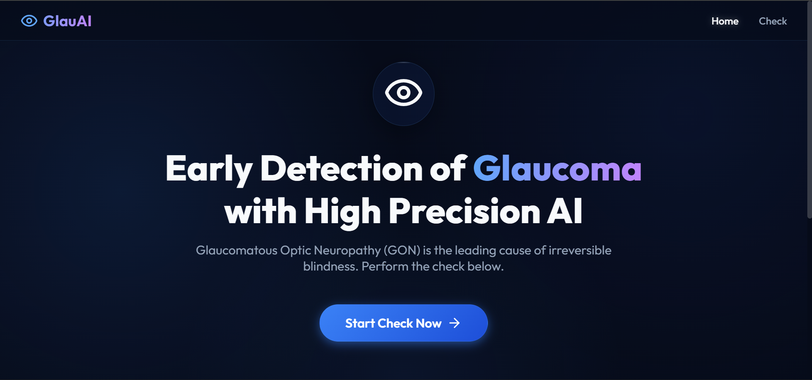

# 👁️ ***Glaucaoma (GON) Detection and Quality Aware - International Data Science Challenge (IDSC)  2026***


> **International Data Science Challenge 2026**  
> Organized by **Universiti Putra Malaysia (UPM)** in partnership with UNAIR, UNMUL, and UB  
> Theme: _Mathematics for Hope in Healthcare_


[](https://python.org)
[](https://pytorch.org)
[](https://react.dev)
[](https://fastapi.tiangolo.com)


---

## 👥 ***Team Members***
| Name | Role | Institution |
|------|------|-------------|
| Adelia Rova Chumairo | ML Engineer · Researcher| UIN Sunan Ampel Surabaya |
| Cahyo Binar Suryapraja | ML Engineer · Video Editor|UIN Sunan Ampel Surabaya |
| Jayanti Fatma Sari | ML Engineer · Researcher  |UIN Sunan Ampel Surabaya |
| Yusuf Fawwaz Kurniawan Djuhara | Full-Stack Develepor · ML Engineer |UIN Sunan Ampel Surabaya | 

---

## 🧠 ***About This Project***
Glaucoma is an eye disease that can cause progressive damage to the optic nerve and may lead to permanent blindness if not detected early. This project focuses on processing medical image data derived from the **Hillel Yaffe Glaucoma Dataset (HYGD): A Gold-Standard Annotated Fundus Dataset for Glaucoma Detection** to identify glaucoma through an artificial intelligence-based classification approach. In this project, fundus images are used as the primary data to detect distinctive patterns that differentiate between normal eye conditions and those indicative of glaucoma. By leveraging the **Convolutional Neural Network (CNN)** method, the system is able to automatically extract important features from the images, such as texture, shape, and characteristics of the optic nerve structure that are difficult to observe manually. 

Furthermore, the features extracted by the CNN are combined with the **Support Vector Machine (SVM)** method as a classifier to enhance the accuracy and overall performance of the model. This hybrid approach takes advantage of CNN’s strength in feature representation and SVM’s capability in constructing optimal decision boundaries between classes. The results of this project are expected to provide a classification system that is not only accurate but also reliable as a supporting tool in the early screening of glaucoma. Thus, this technology has the potential to assist medical professionals in making faster and more precise decisions, especially in regions with limited access to eye care specialists.

--- 

## ✨ Pipeline Highlights

| Component | Detail |
|-----------|--------|
| 📊 **EDA** | Dataset overview · Label distribution · Patient-level analysis · Quality Score analysis · Threshold simulation |
| 🎨 **Preprocessing** | Quality Score Filtering · Resize · Circle Crop · Ben Graham · CLAHE (Green Channel) |
| 🏗️ **Feature Extractor** | EfficientNet-B0, B3 · ResNet-50 (frozen, ImageNet pretrained) |
| 🤖 **Classifier** | SVM (Sigmoid kernel, C=1) with StandardScaler pipeline |
| 🔒 **Validation** | Patient-Level StratifiedGroupKFold (K=5)  |
| 🔍 **Interpretability** | Grad-CAM heatmap on every prediction |
| 🌐 **Web App** | React JS + Vite (Frontend) · FastAPI Python (Backend) |

---

## 📊 Results

### Model Comparison

| Model | Accuracy | Sensitivity | Specificity | AUC | Time |
|-------|----------|-------------|-------------|-----|------|
| 🔵 **EfficientNet-B0 + SVM** | **95.23%** | **97.05%** | **90.73%** | **98.27%** | 2353.15s |
| 🟢 EfficientNet-B3 + SVM | 94.93% | 96.94% | 89.95% | 98.08% | 2501.19s |
| 🔴 ResNet-50 + SVM | 94.29% | 95.83% | 89.86% | 98.14% | 2563.09s |

> 🏆 **Best Model: EfficientNet-B0 + SVM** — highest AUC (98.27%) with shortest training time

---

### EfficientNet-B0 + SVM (As Best Model)

| Fold | Accuracy | Sensitivity | Specificity | AUC |
|------|----------|-------------|-------------|-----|
| Fold 1 | 94.12% | 95.95% | 87.18% | 97.59% |
| Fold 2 | 94.07% | 93.90% | 94.44% | 98.48% |
| Fold 3 | **99.23%** | **100%** | **96.15%** | **99.89%** |
| Fold 4 | 92.54% | 95.40% | 87.23% | 97.31% |
| Fold 5 | 96.21% | **100%** | 88.64% | 98.06% |
| **Mean** | 95.23% | 97.05% | 90.73% | 98.27% |

---

### Visualizations

**ROC Curve Comparison**



**Confusion Matrix per Model**



**Comparion Between Kernel**



**Web Application Preview**



---

## 🗂️ Repository Structure

```
Glaucoma-Detection-EfficientNetB0-SVM/
│
├── 📁 ml/                                         ← Machine Learning Pipeline
│   ├── 01 Exploratory Dataset Analysis (EDA)/
│   │   ├── Exploratory_Dataset_Analysis.ipynb
│   │   └── README.md
│   │
│   ├── 02. Preprocessing/
│   │   ├── Preprocessing.ipynb
│   │   └── README.md
│   │
│   ├── 03. Model and Evaluation/
│   │   ├── Model_and_evaluation.ipynb
│   │   ├── results/
│   │   │   ├── roc_comparison.png
│   │   │   ├── confusion_matrix_comparison.png
│   │   │   ├── metrics_comparison.png
│   │   │   └── evaluasi_svm.xlsx
│   │   └── README.md
│   │
│   └── README.md
│
├── 📁 backend/                                    ← FastAPI Python Backend
│   ├── models/
│   │   └── best_svm.pkl                           ← best model (EfNetB0 fold 3)
│   ├── main.py                                    ← API entry point
│   ├── predictor.py                               ← CNN + SVM inference
│   ├── preprocessor.py                            ← preprocessing pipeline
│   ├── quality_check.py                           ← quality score validation
│   └── requirements.txt
│
├── 📁 frontend/                                   ← React JS + Vite Frontend
│   ├── public/
│   ├── src/
│   │   ├── assets/
│   │   ├── components/
│   │   ├── pages/
│   │   ├── App.css
│   │   ├── App.jsx
│   │   ├── index.css
│   │   └── main.jsx
│   ├── index.html
│   ├── package.json
│   └── vite.config.js
│
├── 📁 docs/                                       ← Screenshots & result images
│   ├── Web.png
│   ├── Roc_Curve.png
│   ├── Confussion_Matrix.png
│   └── Comparison_Kernel.png
│
├── .gitignore
└── README.md                                      ← you are here
``` 
---

## 🔬 Methodology

### 1. Preprocessing Pipeline

```
Labels.csv + Images/
        │
        ▼
┌─────────────────────┐
│  QS Filtering       │  Threshold >= 4.0
└────────┬────────────┘
         ▼
┌─────────────────────┐
│  Resize             │  224×224 (LANCZOS)
└────────┬────────────┘
         ▼
┌─────────────────────┐
│  Circle Crop        │  Remove black background (pad=5)
└────────┬────────────┘
         ▼
┌─────────────────────┐
│  Ben Graham         │  Local contrast enhancement (sigmaX=30)
└────────┬────────────┘
         ▼
┌─────────────────────┐
│  CLAHE              │  Green channel (clipLimit=2.0, tileGrid=8×8)
└────────┬────────────┘
         ▼
    Ready for Extraction ✅
```
 
### 2. Zero Data Leakage Strategy
 
One patient can have multiple fundus images. A naive random split would leak patient identity across train/val sets, inflating metrics. We use `StratifiedGroupKFold` (K=5) grouped by **Patient ID** — the same patient never appears in both train and val within any fold.
 
### 3. CNN Feature Extraction (Frozen)
 
All three CNN backbones are used **without fine-tuning**:
 
| Backbone | Feature Dimension |
|----------|------------------|
| EfficientNet-B0 | 1,280 |
| EfficientNet-B3 | 1,536 |
| ResNet-50 | 2,048 |
 
### 4. Web Application Flow
 
```
User uploads fundus image
        │
        ▼ validate: size < 10MB, format JPG/PNG
        ▼ validate: Quality Score >= threshold
        │  if fail → error + prompt re-upload
        ▼
Preprocessing (Circle Crop → Ben Graham → CLAHE → Normalize)
        │
        ▼
EfficientNet-B0 frozen → Feature Vector (1280-dim)
        │
        ▼
best_svm.pkl → GON+ / GON- + confidence score
        │
        ▼
Grad-CAM heatmap + clinical recommendation
```
 
---
 
## 🚀 How To Run
 
### Prerequisites
 
- Python **3.10+**
- Node.js **18+**
- Git
 
---
 
### Step 1 — Clone Repository
 
```bash
git clone https://github.com/Pawwwwww/Glaucoma-Detection-EfficientNetB0-SVM.git
cd Glaucoma-Detection-EfficientNetB0-SVM
```
 
---
 
### Step 2 — Run Backend (FastAPI)
 
```bash
# 1. Navigate to backend folder
cd backend
 
# 2. Create virtual environment
python -m venv venv
 
# 3. Activate virtual environment
#    Windows:
venv\Scripts\activate
#    Mac/Linux:
source venv/bin/activate
 
# 4. Install dependencies
pip install -r requirements.txt
 
# 5. Run the API server
python main.py
```
 
> ✅ Backend running at **http://localhost:8000**  
> 📄 Interactive API docs at **http://localhost:8000/docs**
 
---
 
### Step 3 — Run Frontend (React + Vite)
 
> ⚠️ Open a **new terminal** — keep the backend terminal running!
 
```bash
# 1. Navigate to frontend folder
cd frontend
 
# 2. Install dependencies
npm install
 
# 3. Run development server
npm run dev
```
 
> ✅ Frontend running at **http://localhost:5173**
 
---
 
### Step 4 — Open the App
 
Open your browser and visit:
 
```
http://localhost:5173
```
 
> ⚠️ **Important:** Both terminals must be running simultaneously:
> - Terminal 1: `python main.py` (backend)
> - Terminal 2: `npm run dev` (frontend)
 
---
 
## 🌐 API Reference
 
| Method | Endpoint | Description |
|--------|----------|-------------|
| `GET` | `/` | Health check — verify backend is running |
| `POST` | `/predict` | Upload fundus image → returns prediction |
 
### POST `/predict`
 
**Request:**
```
Content-Type: multipart/form-data
Body: file  (JPG/PNG, max 10MB)
```
 
**Success Response (200):**
```json
{
  "label"         : "GON+",
  "confidence"    : 87.5,
  "prob_gon_plus" : 87.5,
  "prob_gon_minus": 12.5,
  "quality_score" : 6.2,
  "gradcam_image" : "<base64 encoded JPEG>",
  "saran"         : "Segera konsultasikan dengan dokter spesialis mata..."
}
```
 
**Error Responses:**
```json
400 → { "detail": "Ukuran file melebihi 10MB. Silakan upload ulang." }
400 → { "detail": "Format file tidak didukung. Gunakan JPG atau PNG." }
422 → { "detail": "Kualitas gambar terlalu rendah (QS: 3.2). Pastikan gambar tidak blur." }
500 → { "detail": "Preprocessing gagal: ..." }
```
 
---
 
## 📦 Tech Stack
 
### Backend
 
| Library | Purpose |
|---------|---------|
| `fastapi` | REST API framework |
| `uvicorn` | ASGI server |
| `torch` + `timm` | CNN feature extraction (EfficientNet-B0) |
| `scikit-learn` | SVM classifier + StandardScaler |
| `opencv-python-headless` | Image preprocessing |
| `grad-cam` | Grad-CAM heatmap generation |
| `pillow` | Image I/O |
 
### Frontend
 
| Library | Purpose |
|---------|---------|
| `react` | UI framework |
| `vite` | Build tool & dev server |
| `react-router-dom` | Client-side routing |
| `axios` | HTTP requests to backend |
| `tailwindcss` | Utility-first CSS styling |
 
---
 
## 📚 Dataset & Citation
 
This project uses the **Hillel Yaffe Glaucoma Dataset (HYGD)** from PhysioNet:
 
```bibtex
@misc{abramovich2025hygd,
  author    = {Abramovich, O. and Pizem, H. and Fhima, J. and Berkowitz, E.
               and Gofrit, B. and Van Eijgen, J. and Blumenthal, E. and Behar, J.},
  title     = {Hillel Yaffe Glaucoma Dataset (HYGD): A Gold-Standard Annotated
               Fundus Dataset for Glaucoma Detection (version 1.0.0)},
  year      = {2025},
  publisher = {PhysioNet},
  doi       = {10.13026/z0ak-km33},
  url       = {https://doi.org/10.13026/z0ak-km33}
}
```
 
```bibtex
@article{goldberger2000physiobank,
  author  = {Goldberger, A. and Amaral, L. and Glass, L. and Hausdorff, J.
             and Ivanov, P. and Mark, R. and Mietus, J. and Moody, G.
             and Peng, C. and Stanley, H.},
  title   = {PhysioBank, PhysioToolkit, and PhysioNet:
             Components of a New Research Resource for Complex Physiologic Signals},
  journal = {Circulation},
  volume  = {101},
  number  = {23},
  pages   = {e215--e220},
  year    = {2000}
}
```
 
```bibtex
@article{abramovich2023fundusqnet,
  author  = {Abramovich, O. and Fhima, J. and Lansberg, M. and Van Eijgen, J.
             and Belghith, A. and Berkowitz, E. and Blumenthal, E. and Behar, J.},
  title   = {FundusQ-Net: A regression quality assessment deep learning
             algorithm for fundus images quality grading},
  journal = {Computer Methods and Programs in Biomedicine},
  volume  = {239},
  pages   = {107522},
  year    = {2023}
}
```
 
---
 
## ⚠️ Limitations
 
- Dataset collected from a **single institution** (Hillel Yaffe Medical Center, Israel) — geographic generalizability is limited
- **Single camera model** (TOPCON DRI OCT Triton, 45° FOV) — cross-device validation needed
- This is a **screening tool**, not a replacement for specialist ophthalmologist diagnosis
- Quality Score threshold may need adjustment for different camera types and environments
 
---
 
<div align="center">
 
**IDSC 2026** · Glaucoma GON Detection Pipeline · Mathematics for Hope in Healthcare
 
*Submitted to International Data Science Challenge 2026*
 
</div>